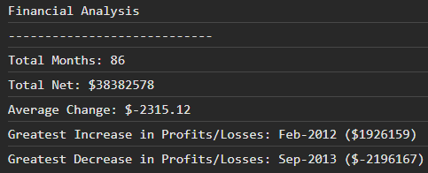

# Console-Finances

https://mdtoy-dev.github.io/Console-Finances/

## Financial Analysis Project

This project performs financial analysis on a dataset of profits and losses over a period. It calculates various metrics such as total months, total net amount, average change, greatest increase, and greatest decrease in profits or losses.

### Usage

1. Clone the repository to your local machine.

2. Navigate to the project directory.

3. Run the analysis script.

### Dataset

The financial data is stored in the finances array within the index.js file. You can replace it with your own dataset or modify the script accordingly.

### Results

The script will output the following financial analysis results to the console:

Total Months
Total Net Amount
Average Change
Greatest Increase in Profits/Losses
Greatest Decrease in Profits/Losses

### License

This project is licensed under the MIT License.